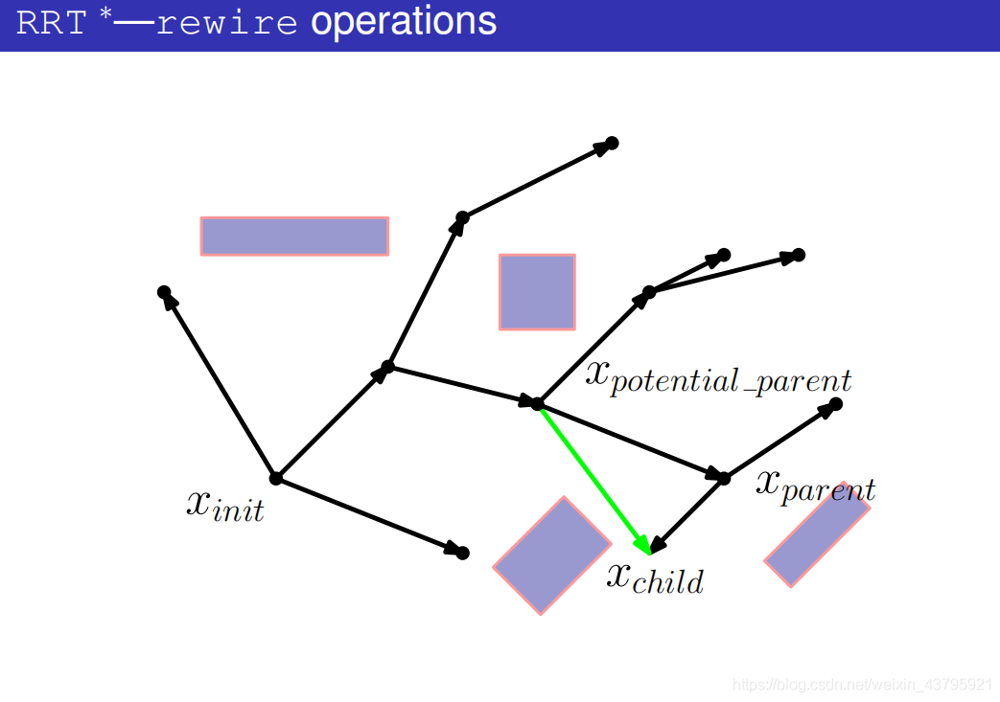

#  一、CDPR Matlab App 中的全局变量和类说明:
## 1.基本机械参数与不同模块的类
### 1.1 动锚点座类`CdprMovAnchor` 

```matlab
CdprMovAnchor MovAnchor
```

`MovAnchor.positon_origin_G`：3X8,global origin position,unit:m

`MovAnchor.positon_G`：3X8矩阵,全局坐标中的锚点座实时位置（绝对形式）,unit:m   

`MovAnchor.positon_L`：1X8矩阵，锚点座局部一维坐标中的锚点座实时位置（增量形式）,unit:m

`MovAnchor.positon_LB`：8X2, local position boundary ,unit:m

`MovAnchor.dir_G`：3X8矩阵, 元素为0,1,-1，每列分别对应锚点座的局部坐标相对全局坐标系移动的正方向，unit:mm  

```matlab
%更新MovAnchor.positon_G的方式
MovAnchor.positon_G = MovAnchor.positon_G + MovAnchor.dir_G .* MovAnchor.positon_L;
```

`MovAnchor.AnRotz_G`：1X8,锚点座坐标系相对全局坐标系对应的Z轴转角（自定义），unit：rad  
`MovAnchor.PulRotz_L`：1X8,滑轮相对应锚点座坐标系的转角（逆时针为正），unit：rad
`MovAnchor.PulCenter`：3X8,滑轮圆心在全局坐标系的坐标，unit：m  
`MovAnchor.caliPosition_L`：1X8，锚点校准位置处的局部坐标（为其全局坐标中可变的坐标分量）  
`MovAnchor.endPosition_L`：1X8，锚点极限位置处的局部坐标（为其全局坐标中可变的坐标分量）  
`MovAnchor.caliPosition_G`：3X8，锚点校准位置处的全局坐标  
`MovAnchor.endPosition_G`：3X8，锚点极限位置处的全局坐标

### 1.2  末端动平台类`CdprPlatform`

```matlab
CdprPlatform Platform
```

`Platform.anchorPosition_P`：3X8，平台锚点的局部坐标  
`Platform.anchorPosition_G`：3X8，平台锚点的全局坐标    

`Platform.anchorDis`：1X28，动平台上两两锚点间的距离，访问索引：$index=\left( j-i \right) +\frac{\left[ \left( 8-1 \right) +\left( 8-i+1 \right) \right] \times \left( i-1 \right)}{2}$ $(j>i，且i=1,...,7)$    

`Platform.anchorUniVec_P`：3X28，动平台上两两锚点间的单位向量（P坐标系）$i->j且i<j$，访问索引：$index=\left( j-i \right) +\frac{\left[ \left( 8-1 \right) +\left( 8-i+1 \right) \right] \times \left( i-1 \right)}{2}$ $(j>i，且i=1,...,7)$    

`Platform.pose_G`：6X1, 实时广义坐标（中心点全局坐标+ZXY欧拉角）  
`Platform.boundary`：3X2, 动平台全局坐标xyz分量的最大最小值（运动边界）

`Platform.poDistance`：设有n个障碍物，数组大小为1Xn，表示动平台与障碍物边界框的最短距离

```matlab
%索引表达式，索引第i根绳与第j根绳间距
index = (j-i) + (7+(9-i))*(i-1)/2;
```

### 1.3 绳缆类`CdprCable`

```matlab
CdprCable Cable
```

`Cable.E`：young's modulus, Pa  
`Cable.A`：绳索横截面积，m^2  
`Cable.K`：绳索的实时刚度（随长度变化）  
`Cable.Length`：绳索的实时伸长长度  
`Cable.UniVector`：绳索实时拉力方向单位向量（G系）  

`Cable.UniVector_P`：绳索实时拉力方向单位向量（P系）  

`Cable.TanLinVector`：从动平台锚点到滑轮切点的向量（G系，带长度与方向）  

`Cable.TanLinVector_P`：从动平台锚点到滑轮切点的向量（P系，带长度与方向）

`Cable.voronoi`：2X8元胞数组，第i列表示第i个绳向量所在的voronoi region的类型和对应元素代号  

`Cable.cpDistance`：1X8数组，以绳索向量与其voronoi region最近元素的夹角正弦值定义距离，为零则干涉，需要与安全距离比较，在点域时距离设为1（最安全）

`Cable.ccDistance`：1X28数组，记录绳两两之间的距离，访问索引：$index=\left( j-i \right) +\frac{\left[ \left( 8-1 \right) +\left( 8-i+1 \right) \right] \times \left( i-1 \right)}{2}$ $(j>i，且i=1,...,7)$

`Cable.coDistance`：设有n个障碍物，数组大小为nX8，每列为对应绳索与n个障碍物的距离。

`Cable.ccDis_min`：允许的最小绳索间距离

`Cable.ccDis_Intersect`：若当前步的绳索间距离小于`ccDis_Intersect`则下一步对两绳索进行交叉干涉检查

`Cable.cpDis_min`：允许的最小绳索与动平台间距离

`Cable. tensionDistrib`： %8X1，绳实时张力分布

### 1.4 障碍物边界框类`ObsBB`（AABB）

```matlab
classdef ObsBB
    % obstacle boundind box 障碍物边界框类
    %   Detailed explanation goes here
    
    properties (Access = public)
        vertices;  %3X8, 存储顶点位置向量
        origin;  %3X1, 原点位置
        R0;  %包络球半径
        Rs;  %检测球半径
        ds;  %安全距离
        d_min; %最小允许距离
        
        velocity=zeros(3,1); %3X1,速度向量
        vertices_Traj; %8X3XN,存储8个顶点在N个轨迹点上的位置向量
        origin_Traj; %3XN,存储原点在N个轨迹点上的位置向量
    end
```


### 1.5 其他机械参数

`R_encoderPully`：（13.35mm）连接滑轮的半径，m  
`R_anchorPully`：（8mm）锚点座出绳滑轮的半径，m  
`S_leadScrew`：（10mm）轨道丝杆的导程，m  
`R_winch`：（18mm）驱动电机绞盘半径，m

`A_T`：6X8结构矩阵（全局坐标系） 

## 2.用于轨迹规划的类与变量
### 2.1 自定义参数
`startPose`： 6X1 开始位姿  
`endPose`： 6X1 结束位姿  
`startTime`：开始时间  
`endTime`：结束时间  
`timeStep`：计算时间步长  
`trajPlanMode`：线性的规划模式选择  

### 2.2 保存末端平台轨迹规划信息的类`PlatformTraj`
`platformTraj.maxVelBound`：规定的不许超出的最大速度（自定义）  
`platformTraj.maxAccelBound`：规定的不许超出的最大加速度（自定义）  
`platformTraj.pos`：3XN，N个点的位置  
`platformTraj.eular`：3XN，N个点的ZXY欧拉角  
`platformTraj.vel`：3XN，N个点三个方向的速度  
`platformTraj.accel`：3XN，N个点三个方向的加速度  
`platformTraj.magVel`：1XN，N个点的速度大小（绝对值）  
`platformTraj.magAccel`：1XN，N个点的加速度大小（绝对值）  
`platformTraj.maxVel`：轨迹上的最大速度  
`platformTraj.maxAccel`：轨迹上的最大加速度  

## 2.3 保存动锚点座轨迹规划信息的类`AnchorTraj`

```matlab
classdef AnchorTraj
    % 保存动锚点单次轨迹规划信息的类
    %   Detailed explanation goes here
    
    properties (Access = public)
        optiFreq; %执行优化算法的频率
        maxAverVelBound; %单步最大允许频率
        maxStepBound; %单步最大允许长度 
        maxStep; %由允许量综合计算得到的最大单步长度
        maxAverVel; %由允许量综合计算得到的最大单步平均速度
        pos; %1X8, 轨迹上各锚点位置
        averVel; %1X8,轨迹上各锚点平均速度
    end
```


## 2.4 保存绳索轨迹规划点上信息的类`CableTraj`

```matlab
classdef CableTraj
    % 保存绳索轨迹规划点上信息的类
    %   Detailed explanation goes here
    
    properties (Access = public)
        cableLength; %8xn, 绳长
        cableTension; %8xn,绳拉力
    end
```


## 2.5 CDPR总体轨迹规划信息类`CdprTrajInfo` 

```matlab
 classdef CdprTrajInfo
    % 保存单次轨迹规划信息的类
    %   Detailed explanation goes here
    
    properties (Access = public)
        platformTraj PlatformTraj %末端平台轨迹规划信息对象
        anchorTraj AnchorTraj %动锚点轨迹规划信息对象
        cableTraj CableTraj %绳索在轨迹规划点上信息的对象
        winchMotorsPos; %绞盘电机绝对转角轨迹
        railMotorsPos; %轨道电机绝对转角轨迹
        winchMotorsSpeed; %绞盘电机速度轨迹
        railMotorsSpeed; %轨道电机速度轨迹
        time; %1XN，时间点序列
        Number; %规划点的数量
        timeStep; %规划时间步长
    end

# 3.末端动平台凸包络拓扑信息
## 3.1 几何元素类
### 点
`Vertex`

​```matlab
classdef Vertex
    properties
        n_verticesId; %相邻点的index
        n_edgesId; %相邻边的index
        n_facesId; %相邻面的index
        localEdgeVector; %3X4,局部单元中边的单位向量
        coordinate; %坐标
     end
end
```
### 边
`Edge`

```matlab
classdef Edge    
    properties
        n_verticesId; %相邻点的index
        n_edgesId; %相邻边的index
        n_facesId; %相邻面的index
        v_facesId; %点连接面的index
     end
end
```
### 面
`Face`

```matlab
classdef Face     
    properties
        n_verticesId; %相邻点的index
        n_edgesId; %相邻边的index
        n_facesId; %相邻面的index
        v_edgesId; %点连接边的index
        v_facesId; %点连接面的index
        normal_vec; %平面外单位法向量
     end
end
```
## 3.2 局部单元的表示
信息储存在`vertex`结构体中邻边、邻点、邻面的排序中（三个数组一一对应并按绕该点逆时针排列）,并将该点
到各个邻点的单位向量存在`vertex.localEdgeVector`中  
## 3.3 Voronoi Region的表示
`Cable.voroRegion`：2X8元胞数组，第i列表示第i个绳向量所在的voronoi region的类型和对应元素代号  
类型：`'v'`-点，`'f'`-面，`'e'`-边，`C`-干涉

```
Cable.voroRegion=2×8 cell array
    {'class of voronoi region'}    ...  {'class of voronoi region'}
    {'index of the corresponding element'}    ...   {'index of the corresponding element'}
```
## 4.用于设置外力条件与可行力的类`WrenchSetting`

```matlab
classdef WrenchSetting
    %设置外力条件与可行力的类
    properties (Access = public)
        wrench; %6X1，外力与外力矩
        feaspTensionRange; %8X2, 张力上下限，(i,1)为第i根绳张力下限，(i,2)为第i根绳张力上限
    end
```

## 5.电机相关

​		MaxonRE35

（1）编码器500线双路 AB输出
（2）电机减速比——14:1（实际可能是13.7:1），输出轴额定转速120RPM

（3）额定功率：90W

（4）输出的 PWM 最大值，限制在 2500，因为满值是 5000，2500 是 5000 的一半，表示电机最大能得到的电压是 48V 的一半，即 24V

（5）输出轴直径：6mm

（6）连续转矩：4Nm；堵转扭矩：40Nm 

# 二、绳索与动平台包络之间的碰撞检测

## 2.1 定义局部单元
如下图所示：  

<div align=center></div>

## 2.2 判定向量 $\vec{l}_{i}$所在的$voronoi$ $region$
### 2.2.1 在顶点域$i$($vertex$ $region$)的情况
$$
\vec{u}_i\cdot \vec{e}_{ij}\leqslant 0 \left( i=1,...,8  j=1,...,4 \right)
$$
### 2.2.2 在边域$\vec{e}_{ij}$($edge$ $region$)的情况
$$
\begin{cases}
	\vec{e}_{ij}\cdot \vec{u}_i>0\\
	\vec{u}_i\cdot \left( \vec{e}_{ij}\times \vec{n}_{ij} \right) =\left[ \vec{e}_{ij}\,\,\vec{n}_{ij}\,\,\vec{u}_i \right] \geqslant0\\
	\vec{u}_i\cdot \left( \vec{e}_{ij}\times \vec{n}_{ij-1} \right) =\left[ \vec{e}_{ij}\,\,\vec{n}_{ij-1}\,\,\vec{u}_i \right] \leqslant0\\
\end{cases}
$$

### 2.2.3 在面域$\vec{n}_{ij}$($face$ $region$)的情况
$$
\begin{cases}
	\vec{n}_{ij}\cdot \vec{u}_i>0\\
	\vec{u}_i\cdot \left( \vec{e}_{ij}\times \vec{n}_{ij} \right) =\left[ \vec{e}_{ij}\,\,\vec{n}_{ij}\,\,\vec{u}_i \right] <0\\
	\vec{u}_i\cdot \left( \vec{e}_{ij+1}\times \vec{n}_{ij} \right) =\left[ \vec{e}_{ij+1}\,\,\vec{n}_{ij}\,\,\vec{u}_i \right] >0\\
\end{cases}
$$
## 2.3 计算向量与其所在域元素的夹角正弦值（即距离）
设定安全角度$\theta_s$ ($0<\theta_s<90^{\circ}$)  
（1） 若在点域，设角度$\theta_i=1$  
（2） 若在边域，$\theta _i=\sqrt{1-\left( \vec{e}_{ij}\cdot \vec{u}_i \right)^2}$  
（3） 若在面域，$\theta _i= \vec{n}_{ij}\cdot \vec{u}_i $  

## 2.4 程序流程图

<div align=center></div>

# 三、绳索之间的碰撞检测

绳索之间的碰撞检测包含距离计算、短距离大步长内的干涉检查（CGAL库实现）。

## 3.1 距离计算原理说明

对于正常计算两绳索的距离需要计算$\complement _{8}^{2}=28$次，这里程序采用CGAL库的函数计算两线段间的最短距离。为了减少执行次数，程序利用前面计算的voronoi region的信息以及绳索向量两起点间距离不变的性质进行优化，在一些情况中简化计算，其原理如下图所示。

<div align=center></div>

## 3.2 程序流程图

### 3.2.1 距离计算程序流程图

距离计算程序流程图如下所示：

<div align=center></div>

### 3.2.2 干涉检测程序

使用CGAL库，与MATLAB对接的MEX程序：`doIntersect_CGAL.mexw64`


# 四、绳索与障碍物之间的碰撞检测
## 4.1 备选方案1：检测球法（废弃）
**注：1.当使用优化算法避障时不采用以下方法计算距离（不连续的约束导致约束边界会突变，优化算法找不到解或直接收敛到不合理的解），而是直接采用openGJK计算最短距离。2. 2021/4/30记：该方案废弃，原因在于约束不连续，不便于搜索结果。**
### 4.1.1 原理说明

障碍物由AABB(aligned axis bounding box)包络，设定一个检测球区域以简化计算，设AABB的外包络球半径为$r_0$，设定安全距离$d_s$，则检测球半径$r_s=r_0+d_s$，当绳索在该检测球以外时则计算绳索与球心的距离（将该距离作为绳索到障碍物的距离），若该距离小于检测球半径（绳索在球内），则用CGAL库计算绳索到AABB的最短距离，设定一个允许的最小距离$d_{min}$($d_s>d_{min}$)，可设$d_s=(1.5\sim2)d_{min}$。原理图如下：

<div align=center></div>

### 4.1.2 程序流程图 

<div align=center></div>

## 4.2 动态障碍物碰撞检测规则


# 五、力分配算法

## 5.1 Improved Closed-Form solution

### 5.1.1 算法流程


<div align=center></div>

### 5.1.2 引用

`Pott A. Cable-driven Parallel Robots: Theory and Application[M]. Switzerland: Springer International Publishing AG, 2018：94-95`
# 六、动态、静态避障（末端轨迹已知）

## 6.1 程序说明

###  策略1：优化算法

#### 1. 参数与变量

$\boldsymbol{P}_{traj}$：轨迹数据		$timeSque$：轨迹时间序列		$k_{op}$：优化频率，$k_{op}$个时间步长执行一次优化算法		

$maxStep$：锚点轨迹$\boldsymbol{A}_{traj}$上相邻两个点分量的最大间隔

$anchorTrajId$：锚点轨迹点对应时间序列$timeSque$的索引信息

$\boldsymbol{A}_{traj}$：锚点轨迹点信息

#### 2. 优化目标与优化方案

##### 目标1：力分布均匀，见[附录1](#1.受力与结构矩阵分析)

##### 方案1：绳索构型与分布力同时优化

（1）优化函数：$f_1=\min\frac{\sum_{i=1}^m{\left( f_i-\bar{f} \right) ^2}}{m}$

（2）优化变量：8个动锚点步长+8个绳索力

##### 方案2：先优化绳索构型，在力分布算法中再分配力

（1）优化函数：$f_1=\min \left\| \sum_{i=1}^8{\vec{u}_i} \right\|_2^2 $

（2）优化变量：8个动锚点步长+8个绳索力

##### 目标2：离障碍物最远

优化函数：$f_2=\min (-\|Cable.coDistance\|_2)$

##### 目标3：某一方向刚度最小


### 策略2：决策算法+RRT*


## 6.2 程序流程图

### 6.2.1 基于优化算法的主程序部分

<div align=center></div>

### 6.2.2 计算约束的部分

<div align=center></div>


# 附录

## 1.受力与结构矩阵分析

### 1.1 绳索拉力平衡方程
$$
\begin{bmatrix}
 \vec{u_1}& \vec{u_2} & \cdots & \vec{u_8}\\ 
 \vec{b_1}\times\vec{u_1} & \vec{b_2}\times\vec{u_2} & \cdots & \vec{b_8}\times\vec{u_8}
\end{bmatrix}
\begin{bmatrix}
   \vec{f_1}
\\ \vec{f_2}
\\ \vdots 
\\ \vec{f_8}
\end{bmatrix}
=-\vec{w}
$$

其中定义结构矩阵$A^T
=
\begin{bmatrix}
 \vec{u_1}& \vec{u_2} & \cdots & \vec{u_8}\\ 
 \vec{b_1}\times\vec{u_1} & \vec{b_2}\times\vec{u_2} & \cdots & \vec{b_8}\times\vec{u_8}
\end{bmatrix}$，并令$\vec{f}=\begin{bmatrix}
   \vec{f_1}
& \vec{f_2}
& \cdots 
& \vec{f_8}
\end{bmatrix}^T$

求通解：$\exists \lambda_H,\vec{f}=-{A^+{^T}}\vec{w} + H\lambda_H$

### 1.2 MATLAB计算绳拉力

```matlab
%% 力分布情况计算
%构造结构矩阵（structure matrix）
A = zeros(6,8);
for i=1:8
    bi = Platform_Next.anchorPosition_G(:, i) - Platform_Next.pose_G(1:3);
    A(:, i) = [Cable.UniVector(:, i); cross(bi,Cable.UniVector(:, i))];
end
%A_psedoInv = psedoInverse_svd(A); %计算A的伪逆（svd法，稳定性更好，较慢）
A_psedoInv = A'*inv(A'*A); %计算A的伪逆（计算逆时需要保证A'A非奇异）
H = null(A); %计算A的零空间（核空间）中的一个基
W =wrenchSetting.wrench; %外力与力矩
tension = - A_psedoInv * W + H*lamda; %计算张力分布向量
```

## 2.RRT*算法流程

### 2.1 Pseudo Code

<div align=center></div>

<div align=center></div>

### 2.2 图解

#### (1)产生一个随机点$x_{rand}$

<div align=center></div>

#### (2)在树上找到与$x_{rand}$最近的节点$x_{nearest}$

<div align=center></div>

#### (3)连接$x_{rand}$与$x_{nearest}$

<div align=center></div>

#### (4)以$x_{rand}$为中心，$r_i$为半径，在树上搜索节点

<div align=center></div>

#### (5)找出潜在的父节点集合$X_{potential\_parent}$，其目的是要更新$x_{rand}$，看看有没有比它更好的父节点

<div align=center></div>

#### (6)从某一个潜在的父节点$X_{potential\_parent}$开始考虑

<div align=center></div>

#### (7)计算出$x_{parent}$作为父节点时的代价

<div align=center></div>

#### (8)先不进行碰撞检测，而是将$x_{parent}$与$x_{child}$（也就是$x_{rand}$）连接起来

<div align=center></div>

#### (9)计算出这条路径的代价

<div align=center></div>

#### (10)将新的这条路径的代价与原路径的代价作比较，如果新的这条路径的代价更小则进行碰撞检测，如果新的这条路径代价更大则换为下一个潜在的父节点

<div align=center></div>

#### (11)碰撞检测失败，该潜在父节点不作为新的父节点

<div align=center></div>

#### (12)开始考虑下一个潜在父节点

<div align=center></div>

#### (13)将潜在父节点和$x_{child}$连接起来

<div align=center></div>

#### (14)计算出这条路径的代价

<div align=center></div>

#### (15)将新的这条路径的代价与原路径的代价作比较，如果新的这条路径的代价更小则进行碰撞检测，如果新的这条路径代价更大则换为下一个潜在的父节点

<div align=center></div>

#### (16)碰撞检测通过

<div align=center></div>

#### (17)在树中将之前的边删掉

<div align=center></div>

#### (18)在树中将新的边添加进去，将$x_{potential\_parent}$作为$x_{parent}$

<div align=center></div>

#### (19)遍历所有的潜在父节点，得到更新后的树

<div align=center></div>

## 3. 一些重要参数数据

### 3.1 各路的非自由段绳长

**第1、2、3、4路**：507.22mm	**第5、7路**：1465.77mm	**第6、8路**：1579.39mm

### 3.2 锚点校准位置坐标

```matlab
positon_origin_G = [468.5 -334 135;
                    468.5  334 135;
                    -468.5  334 135;
                    -468.5 -334 135;
                    415    0   608;
                    0    378.5 608;
                    -415    0   608;
                    0   -378.5 608]'*1e-3;  % 3X8,global origin position,unit:m 
                    
caliPosition_L = [121.5 121.5 121.5 121.5 -267.5 -314 -267.5 -314]*1e-3;   % 1X8, local linear rail calibration position，unit:m
```

**无法用激光跟踪仪标定位置时**：

1~4动锚点座可用游标卡尺量锚点座的上端到末端基座平面铝横梁的距离来确定初始位置。初始位置该尺寸为146.5mm，校准位置该尺寸为133mm，如下图。

<div align=center></div>

### 3.3 机座原点坐标系与UR5机械臂坐标系间的转换关系

**第一次标定实验记录**：

机械臂TCP坐标无偏移（使用默认设置）；

标定时的偏移距离（标定用的杆长）：510mm；固定障碍物的上表面偏移距离：330mm

标定UR5机械臂TCP坐标为——TCP位置坐标[-502.13, -521.11, -195.76]（mm），姿态（RPY）[3.134, 0, 2.339]（rad）

### 3.4 机械臂与PC的IP设置

PC的IP地址：192.168.1.20；子网掩码：255.255.255.0

## 4.仿真实验记录

### 4.1 纯仿真

（1）末端确定，优化算法-力均匀，障碍物静止：

​	障碍物保存名——`testObs1_static1`;	仿真结果保存名——`result1_static1`;	

​	动锚点最大步长——0.03m；动锚点最大速度——0.06m/s；

​	末端最大允许速度——0.04m/s；末端最大允许加速度——0.02m/(s^2)；

（2）末端确定，优化算法-刚度矩阵的迹最大，障碍物静止：

​	障碍物保存名——`testObs1_static2`;	仿真结果保存名——`result1_static2`;	

​	动锚点最大步长——0.03m；动锚点最大速度——0.06m/s；

​	末端最大允许速度——0.04m/s；末端最大允许加速度——0.02m/(s^2)；

（3）末端确定，优化算法-力均匀，障碍物运动：

​	障碍物保存名——`testObs1_dynamic1`;	仿真结果保存名——`result1_dynamic1`;	

​	动锚点最大步长——0.03m；动锚点最大速度——0.06m/s；

​	末端最大允许速度——0.04m/s；末端最大允许加速度——0.02m/(s^2)；

（4）末端确定，优化算法-刚度矩阵的迹最大，障碍物运动：

​	障碍物保存名——`testObs1_dynamic2`; 仿真结果保存名——`result1_dynamic2`;	

​	动锚点最大步长——0.03m；动锚点最大速度——0.06m/s；

​	末端最大允许速度——0.04m/s；末端最大允许加速度——0.02m/(s^2)；

### 4.2 实际避障测试+仿真

**注：动锚点座速度不可超过0.02m/s！**

（1）末端确定，优化算法-力均匀，障碍物静止：

​	障碍物保存名——`testObs1_static1_1`;	仿真结果保存名——`result1_static1_1`;	

​	动锚点最大步长——0.03m；动锚点最大速度——0.02m/s；

​	末端最大允许速度——0.03m/s；末端最大允许加速度——0.05m/(s^2)；

（2）末端确定，优化算法-刚度矩阵的迹最大，障碍物静止：

​	障碍物保存名——`testObs1_static1_1`;	仿真结果保存名——`result1_static1_2`;	

​	动锚点最大步长——0.03m；动锚点最大速度——0.02m/s；

​	末端最大允许速度——0.02m/s；末端最大允许加速度——0.05m/(s^2)；

（3）末端确定，优化算法-力均匀，障碍物运动：

​	障碍物保存名——`testObs1_dynamic1_1`;	仿真结果保存名——`result1_dynamic1_1`;	

​	动锚点最大步长——0.03m；动锚点最大速度——0.02m/s；

​	末端最大允许速度——0.04m/s；末端最大允许加速度——0.02m/(s^2)；

（4）末端确定，刚度矩阵的迹最大，障碍物运动：

​	障碍物保存名——`testObs1_dynamic1_2`;	仿真结果保存名——`result1_dynamic1_2`;	

​	动锚点最大步长——0.03m；动锚点最大速度——0.02m/s；

​	末端最大允许速度——0.03m/s；末端最大允许加速度——0.02m/(s^2)；

